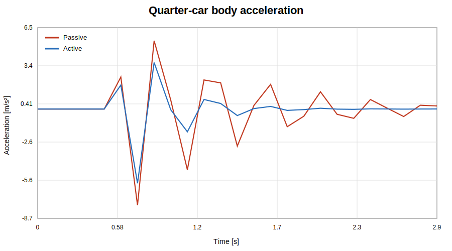
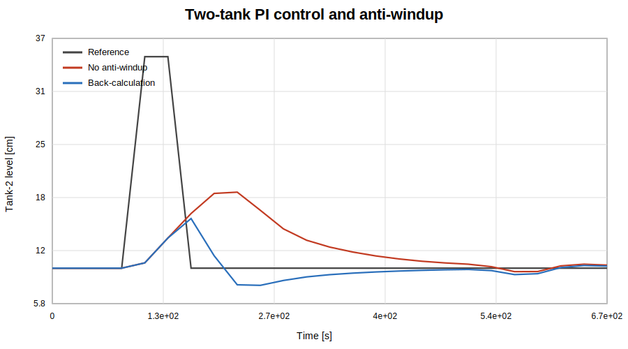

# Automatic Control Laboratory Projects

[](https://github.com/seneserisen/automatic-control-lab-projects/actions/workflows/validate.yml)
[](https://github.com/seneserisen/automatic-control-lab-projects/actions/workflows/matlab.yml)

A curated control-engineering portfolio with five reproducible MATLAB experiments, direct MATLAB unit tests, and an independent Python validation layer.

The repository reconstructs the main engineering ideas from a four-person **Automatic Control I** laboratory portfolio at FAU Erlangen-Nürnberg. The public code was rebuilt from first principles rather than copied from raw team submissions or university material.

## Why this repository exists

The objective is not to present five isolated scripts. It is to demonstrate a consistent control-engineering workflow:

1. define the physical or nonlinear model;
2. identify an operating point or state-space representation;
3. analyse stability, controllability and observability;
4. design a controller or state observer;
5. simulate disturbances, noise and actuator limits;
6. calculate repeatable performance metrics;
7. test requirements in MATLAB and Python;
8. document what the model can and cannot prove.

## Projects

| Project | Main methods | Published result |
|---|---|---|
| [Nonlinear control loops](projects/nonlinear-control-loops/) | Jacobian linearisation, equilibrium stability, controllability, local state feedback | Linearisation error increases away from the operating point |
| [Elastically mounted rotary arm](projects/rotary-arm/) | Fifth-order trajectory, feedback, feedforward, 2-DOF control, load disturbance | 2-DOF tracking RMSE is about 70% lower |
| [Quarter-car active suspension](projects/active-suspension/) | State-space modelling, LQR, road disturbance, actuator saturation | RMS body acceleration is reduced by about 35% |
| [Magnetic levitation](projects/magnetic-levitation/) | Nonlinear plant, pole placement, Luenberger observer, sensor noise, convergence study | Position-estimation RMSE is below 0.001 mm |
| [Two-tank process](projects/two-tank-system/) | Nonlinear hydraulics, PI control, saturation, anti-windup | Recovery improves from about 429 s to 312 s |

Detailed values are generated from executable reference models and committed in [docs/results-summary.md](docs/results-summary.md).

## Preview results

| Active suspension | Magnetic levitation | Two-tank anti-windup |
|---|---|---|
|  |  |  |

## Repository architecture

```text
projects/                  MATLAB experiments and project-specific functions
matlab/+control_lab/       Shared RK4, saturation, tracking and recovery utilities
matlab/tests/              Direct matlab.unittest verification
validation/                Independent Python reference models and generated metrics
tests/                     Python numerical and physical-behaviour tests
docs/                      Architecture, results, traceability and validation notes
.github/workflows/         Python and MATLAB CI workflows
```

See [docs/architecture.md](docs/architecture.md) and [docs/verification-matrix.md](docs/verification-matrix.md).

## Technical coverage

- Nonlinear differential-equation modelling
- Operating-point and Jacobian linearisation
- State-space modelling, controllability and observability
- Pole and eigenvalue analysis
- Luenberger state observers and output-feedback control
- Deterministic sensor-noise injection
- P, PI, state-feedback, pole-placement and LQR concepts
- Smooth reference trajectories and two-degree-of-freedom control
- Disturbance rejection
- Actuator saturation and back-calculation anti-windup
- Fourth-order Runge-Kutta simulation and step-size convergence
- Reproducible performance metrics and dual-runtime CI

## Quick start

### MATLAB

From the repository root:

```matlab
run_all
```

Run the modular observer experiment:

```matlab
run('projects/magnetic-levitation/magnetic_levitation_demo.m')
```

Run MATLAB tests locally:

```matlab
results = runtests('matlab/tests', 'IncludeSubfolders', true);
assertSuccess(results);
```

Recommended environment:

- MATLAB R2021b or later for local runs
- CI uses MATLAB R2024b
- Control System Toolbox is optional; verified fallback gains are included
- No `.slx` files are required for the clean-room demonstrations

Automated tests verify the shared utilities and modular magnetic-levitation observer. Complete [docs/manual-validation-checklist.md](docs/manual-validation-checklist.md) for full figure and demonstration review.

### Python validation

```bash
python -m venv .venv
source .venv/bin/activate  # Windows: .venv\Scripts\activate
pip install -r requirements.txt
ruff check .
ruff format --check .
pytest -q
python -m validation.generate_reference_figures --check-only
python -m validation.report --check
```

To regenerate the SVG previews and results summary:

```bash
python -m validation.generate_reference_figures
python -m validation.report
```

## Validation strategy

The MATLAB functions are the main portfolio implementations. MATLAB CI executes `matlab.unittest` directly in a real MATLAB runtime.

The Python layer independently mirrors the equations to provide:

- multi-version regression checks;
- deterministic result figures;
- physical and numerical assertions;
- generated-results freshness checks;
- an independent implementation of the observer and convergence study.

Using both runtimes reduces the risk that one implementation contains an undetected modelling or syntax error.

## Limitations

These are educational models, not production controllers. They do not establish:

- hardware-in-the-loop performance;
- real-time timing guarantees;
- certified sensor or actuator reliability;
- robust stability across untested parameter ranges;
- functional-safety compliance;
- equivalence to the original team submission.

Each project README states its specific assumptions and missing validation.

## Academic attribution

The historical laboratory exercises were completed in a four-person team. The repository contains new clean-room portfolio reconstructions. See [NOTICE.md](NOTICE.md) and [docs/team-contributions-template.md](docs/team-contributions-template.md).
