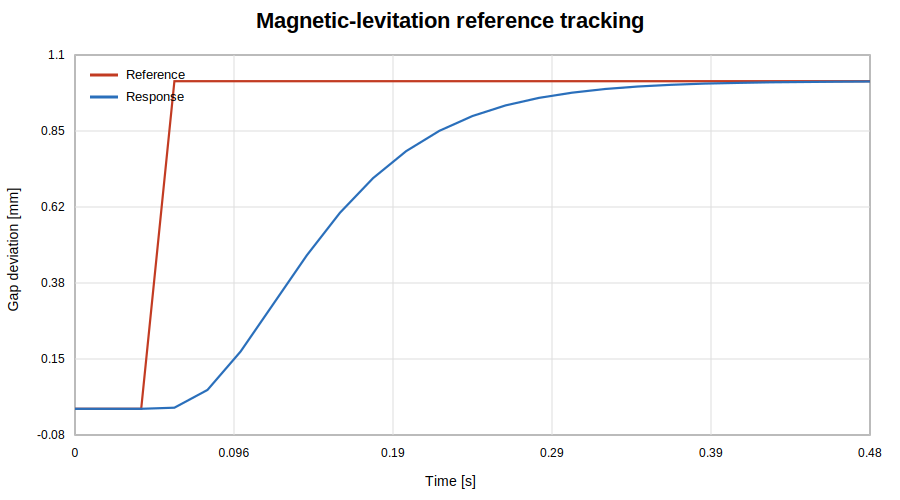

# Magnetic Levitation Control

Magnetic levitation is nonlinear and open-loop unstable. This project now progresses from local full-state feedback to an **output-feedback observer** that measures only air gap and coil current while estimating ball velocity.

## Engineering question

Can the nonlinear plant remain stable and track a small air-gap command when velocity is not measured directly and the available sensors contain noise?

## Parameters

| Parameter | Value |
|---|---:|
| Ball mass | 0.068 kg |
| Equilibrium gap | 0.014 m |
| Magnetic coefficient | 6.53×10⁻⁵ |
| Coil inductance | 0.4125 H |
| Total resistance | 11 Ω |
| Voltage range | 0–30 V |
| Gap-noise standard deviation | 0.005 mm |
| Current-noise standard deviation | 0.002 A |
| Noise seed | 42 |

The equilibrium current is approximately `2.0011 A`, requiring about `22.0124 V` at steady state.

## Modular architecture

```text
maglev_configuration.m
        ↓
maglev_linear_model.m
        ↓
design_maglev_observer.m
        ↓
simulate_maglev_observer.m
        ↓
calculate_maglev_observer_metrics.m
        ↓
plot_maglev_observer_results.m
```

`magnetic_levitation_demo.m` is now only the orchestration layer. Plant equations, controller design, observer design, simulation, metrics, and plotting are independently testable functions.

## Controller and observer

The controller poles are near:

```text
-20, -30, -40
```

The observer poles are placed faster:

```text
-80, -90, -100
```

Measured outputs:

- air-gap deviation;
- coil-current deviation.

Estimated state:

- ball velocity.

The output-feedback law is

\[
u=-K\hat{x}+N_r r
\]

and the observer is

\[
\dot{\hat{x}}=A\hat{x}+Bu+L(y-C\hat{x}).
\]

## Reproducible results

### Local-model validation

- Open-loop maximum pole real part: approximately `37.44 1/s`
- Closed-loop maximum pole real part: approximately `-20.02 1/s`
- Linear/nonlinear position RMSE: approximately `0.000909 mm`

### Observer experiment

- Observability rank: `3`
- Full-state tracking RMSE: approximately `0.191583 mm`
- Observer-based tracking RMSE: approximately `0.189870 mm`
- Position-estimation RMSE: approximately `0.000649 mm`
- Velocity-estimation RMSE: approximately `0.00003398 m/s`
- Current-estimation RMSE: approximately `0.00010277 A`
- Maximum observer-control voltage: approximately `22.8253 V`

### Numerical convergence

The no-noise fixed-step study compares 0.8, 0.4, 0.2, 0.1, and 0.05 ms steps. Between 0.1 ms and 0.05 ms:

- final-position difference is approximately `0.000004 mm`;
- maximum-voltage difference is approximately `0.000057 V`.

This supports the selected `0.1 ms` simulation step for the published experiment.

## Run

```matlab
magnetic_levitation_demo
```

Run only the convergence study:

```matlab
study = maglev_convergence_study();
```

## Direct MATLAB tests

The repository includes `matlab.unittest` coverage for:

- observability;
- controller and observer stability;
- noisy output-feedback tracking;
- deterministic seeded noise;
- voltage limits;
- fixed-step convergence;
- shared numerical utilities.

These tests run in GitHub Actions through the official MathWorks actions.

## Assumptions and limitations

- gap and coil current are measured directly;
- sensor noise is Gaussian and independently sampled;
- the observer uses the local linear model while controlling the nonlinear plant;
- the controller is valid only near the 14 mm equilibrium;
- magnetic saturation, eddy currents and sensor dynamics are omitted;
- voltage delay, quantisation and emergency shutdown behaviour are not simulated;
- robustness to systematic parameter error requires a separate Monte Carlo study.

## Preview


