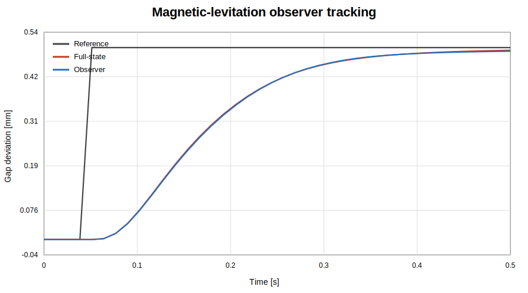

# Magnetic Levitation Control

Magnetic levitation is nonlinear and open-loop unstable. This project progresses from local full-state feedback to an **output-feedback observer** that measures only air gap and coil current while estimating ball velocity. The validated design is also implemented as a portable C99 runtime.

## Engineering question

Can the nonlinear plant remain stable and track a small air-gap command when velocity is not measured directly, the available sensors contain noise, and the runtime is expressed in a deterministic embedded-oriented form?

## Source-document reconstruction

The historical team material included modelling steps, controller design, MATLAB scripts, Simulink work, experimental questions, plots, and report discussion. The public project converts those documents into:

- original modular MATLAB functions;
- direct MATLAB tests;
- an independent Python reference;
- a portable C observer runtime;
- generated metrics and plots;
- explicit assumptions and limitations.

The raw university material and team reports are not published. See [../../docs/source-reconstruction-map.md](../../docs/source-reconstruction-map.md).

## Parameters

| Parameter | Value |
|---|---:|
| Ball mass | 0.068 kg |
| Equilibrium gap | 0.014 m |
| Magnetic coefficient | 6.53×10⁻⁵ |
| Coil inductance | 0.4125 H |
| Total resistance | 11 Ω |
| Voltage range | 0–30 V |
| Gap-noise standard deviation | 0.005 mm |
| Current-noise standard deviation | 0.002 A |
| Noise seed | 42 |

The equilibrium current is approximately `2.0011 A`, requiring about `22.0124 V` at steady state.

## Modular MATLAB architecture

```text
maglev_configuration.m
        ↓
maglev_linear_model.m
        ↓
design_maglev_observer.m
        ↓
simulate_maglev_observer.m
        ↓
calculate_maglev_observer_metrics.m
        ↓
plot_maglev_observer_results.m
```

`magnetic_levitation_demo.m` is only the orchestration layer. Plant equations, controller design, observer design, simulation, metrics, and plotting are independently testable functions.

## Controller and observer

The controller poles are near:

```text
-20, -30, -40
```

The observer poles are placed faster:

```text
-80, -90, -100
```

Measured outputs:

- air-gap deviation;
- coil-current deviation.

Estimated state:

- ball velocity.

The output-feedback law is

\[
u=-K\hat{x}+N_r r
\]

and the observer is

\[
\dot{\hat{x}}=A\hat{x}+Bu+L(y-C\hat{x}).
\]

## Reproducible results

### MATLAB and Python reference results

- Observability rank: `3`
- Full-state tracking RMSE: approximately `0.191583 mm`
- Observer-based tracking RMSE: approximately `0.189870 mm`
- Position-estimation RMSE: approximately `0.000649 mm`
- Velocity-estimation RMSE: approximately `0.00003398 m/s`
- Current-estimation RMSE: approximately `0.00010277 A`
- Maximum observer-control voltage: approximately `22.8253 V`

### C runtime results

The C runtime uses the same plant parameters, gains, sample time, command, noise magnitudes, and voltage limits. It uses a deterministic C-specific random-number generator, so individual noisy samples are not expected to match MATLAB or NumPy exactly.

Representative C results with seed 42:

- final position: approximately `0.501224 mm`;
- observer tracking RMSE: approximately `0.190917 mm`;
- position-estimation RMSE: approximately `0.000594 mm`;
- velocity-estimation RMSE: approximately `0.00003607 m/s`;
- current-estimation RMSE: approximately `0.00009038 A`;
- maximum voltage: approximately `22.8311 V`.

The physical conclusions agree across all three implementations.

### Numerical convergence

The no-noise fixed-step study compares 0.8, 0.4, 0.2, 0.1, and 0.05 ms steps. Between 0.1 ms and 0.05 ms:

- final-position difference is approximately `0.000004 mm`;
- maximum-voltage difference is approximately `0.000057 V`.

The C tests repeat the 0.1 ms versus 0.05 ms comparison with the same acceptance tolerances.

## Run MATLAB

```matlab
magnetic_levitation_demo
```

Run only the convergence study:

```matlab
study = maglev_convergence_study();
```

## Build and run C

From the repository root:

```bash
cmake -S c -B build/c -DCMAKE_BUILD_TYPE=Release
cmake --build build/c --parallel
ctest --test-dir build/c --output-on-failure
./build/c/maglev_observer_demo
```

The C runtime provides:

- C99 compatibility;
- no dynamic allocation;
- fixed-size states and measurements;
- fixed-step RK4;
- deterministic noise;
- voltage saturation;
- online metrics;
- configuration validation;
- GCC and Clang CI.

## Automated tests

### MATLAB

The `matlab.unittest` suite covers:

- observability;
- controller and observer stability;
- noisy output-feedback tracking;
- deterministic seeded noise;
- voltage limits;
- fixed-step convergence;
- shared numerical utilities.

### Python

The Python suite independently checks:

- observer stability and observability;
- noisy tracking and estimation quality;
- deterministic seeds;
- invalid input handling;
- fixed-step convergence.

### C

The CTest executable checks:

- configuration rejection;
- noise-free tracking;
- voltage saturation;
- deterministic seeded execution;
- fixed-step convergence;
- bounded tracking and estimation metrics.

## Assumptions and limitations

- gap and coil current are measured directly;
- sensor noise is simplified Gaussian white noise;
- MATLAB, Python, and C use different random-number generators;
- the observer uses the local linear model while controlling the nonlinear plant;
- the controller is valid only near the 14 mm equilibrium;
- magnetic saturation, eddy currents, and sensor dynamics are omitted;
- voltage delay, quantisation, scheduling jitter, and emergency shutdown behaviour are not simulated;
- the C implementation is not yet fixed-point, MISRA-C checked, or connected to real ADC/PWM drivers;
- robustness to systematic parameter error requires a separate Monte Carlo study;
- no hardware or safety certification claim is made.

## Preview


