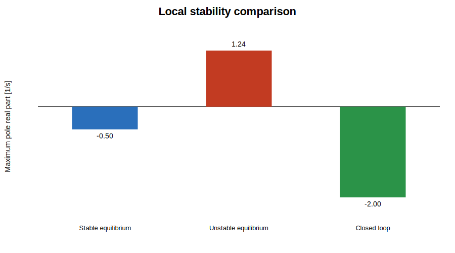

# Nonlinear Control-Loop Analysis

This experiment shows why a controller designed from a linear model is valid only near its chosen operating point.

## Engineering question

How do equilibrium selection and perturbation size affect stability and the accuracy of a local linear model?

## Model

\[
\dot{x}_1=-x_1^3+x_2
\]

\[
\dot{x}_2=x_1+x_2-2+(1-x_1)^2+(1-x_2)^2+u
\]

The model has equilibria at `[0,0]` and `[1,1]`. The second equilibrium is locally unstable.

## Experiment workflow

1. derive the Jacobian analytically;
2. evaluate it at both equilibria;
3. check controllability at `[1,1]`;
4. apply `K=[1,3]`, placing the local poles at `-2` and `-3`;
5. compare nonlinear and linearised closed-loop responses for near and farther initial conditions;
6. quantify the model mismatch with RMSE.

## Reproducible results

- Controllability rank: `2`
- Near-point linearisation RMSE: approximately `0.000020`
- Farther-point linearisation RMSE: approximately `0.003307`

The farther perturbation produces more than two orders of magnitude more model error, demonstrating the local nature of Jacobian linearisation.

## Run

```matlab
nonlinear_control_demo
```

## Assumptions and limitations

- full state measurement is assumed;
- the feedback law is not saturated;
- no measurement noise is included;
- the chosen nonlinear equations are educational rather than tied to a specific physical plant;
- no region-of-attraction proof is provided.

## Preview


