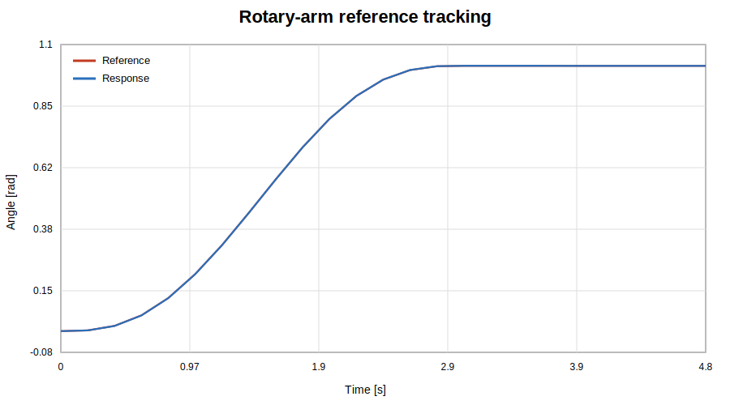

# Elastically Mounted Rotary Arm

This experiment compares feedback-only tracking with a two-degree-of-freedom design that combines model-based feedforward and feedback disturbance rejection.

## Plant model

\[
y^{(3)}+a_2\ddot{y}+a_1\dot{y}=b u
\]

with `a1=6`, `a2=2` and `b=1`.

## Experiment workflow

1. generate a fifth-order point-to-point trajectory;
2. calculate velocity, acceleration and jerk references;
3. derive the inverse-model feedforward command;
4. simulate feedback-only and 2-DOF controllers using RK4;
5. inject a load disturbance after the motion is complete;
6. compare tracking RMSE and control limits.

## Reproducible results

- Feedback-only tracking RMSE: approximately `0.012797 rad`
- 2-DOF tracking RMSE: approximately `0.003787 rad`
- RMSE improvement: approximately `70.4%`
- Peak 2-DOF control magnitude: approximately `4.401`, below the limit of `25`

## Why fifth order?

A fifth-order polynomial has six coefficients, allowing position, velocity and acceleration constraints at both ends of the move.

## Run

```matlab
rotary_arm_demo
```

## Assumptions and limitations

- the plant parameters are exact in the feedforward model;
- full position, velocity and acceleration states are available;
- Coulomb friction and backlash are omitted;
- actuator dynamics are represented only by a magnitude limit;
- the load disturbance is an equivalent input disturbance.

## Preview


